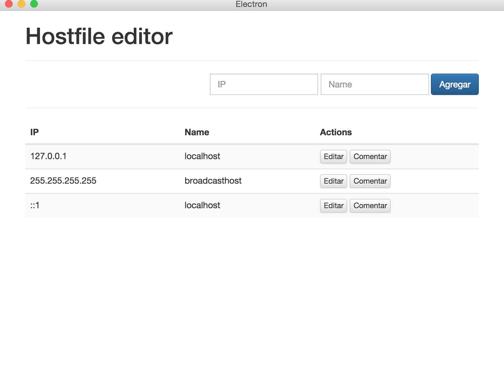

# hostsedit
Hosts file editor based in Electron.

# roadmap
* Load and Save the hosts file.
* Load and view multiple versions of the hosts file, local, dev, production
* Collapse multiple entries for a domain.
* Search
